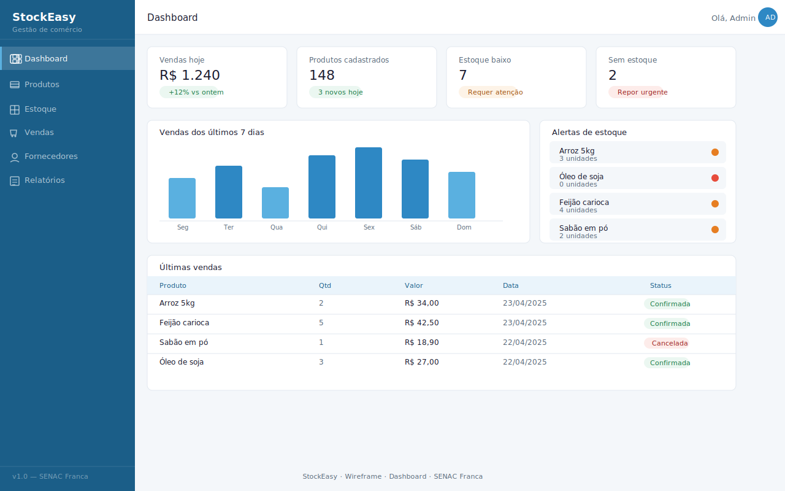
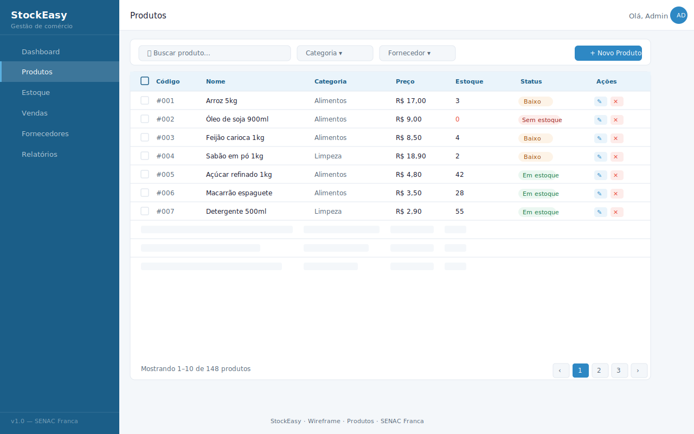
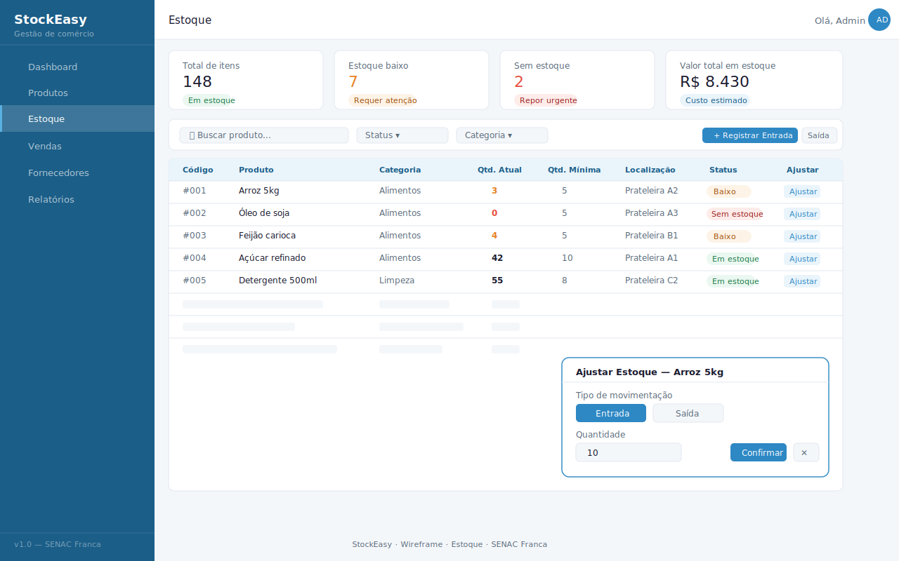

---
<h3 align="center">S t o c k E a s y </h3>
---

Controle simples, negocio forte.

> O StockEasy e um sistema web voltado para pequenos comercios que ainda controlam estoque e vendas de forma manual (cadernos, planilhas ou memoria). O sistema oferece uma interface simples e objetiva para gerenciar produtos, registrar vendas e acompanhar o desempenho do negocio.

> O projeto está dividido em 8 etapas que podem ser desenvolvidas ao longo do curso, de forma incremental, Cada etapa resulta em uma versão funcional do sistema.
> Etapa | O que desenvolver | Entregável | Status
> :--: | :--: | :--: | :--:
> 1 | Planejamento e prototipagem das telas | Wireframes das principais telas | :heavy_check_mark:
> 2 | Configuração do ambiente e banco de dados | Banco criado e documentado | :heavy_multiplication_x:
> 3 | Autenticação (login e sessão) | Tela de login funcional | :heavy_multiplication_x:
> 4 | CRUD de produtos e categorias | Cadastro de produtos completo | :heavy_multiplication_x:
> 5 | Controle de estoque | Entradas e saidas com alertas | :heavy_multiplication_x:
> 6 | Modulo de vendas | Registro de vendas com itens | :heavy_multiplication_x:
> 7 | Relatorios e Dashboard | Painel com gráficos e resumos | :heavy_multiplication_x:
> 8 | Testes, ajustes e apresentação | Sistema final documentado | :heavy_multiplication_x:
>
> <!-- Use se for completo: :heavy_check_mark: -->

## 📌 O que foi feito nessa etapa

Nessa etapa foi criada a **identidade visual oficial** do projeto e os **wireframes de todas as páginas web** do sistema StockEasy.

### ✅ Entregáveis

- Paleta de cores oficial definida (PDF)
- Wireframe da tela de **Login** (feito manualmente)
- Wireframes das 6 telas principais em formato **SVG** (importável no Figma)

---

## 🎨 Paleta de Cores

| Cor              | Hex       | Uso                |
| ---------------- | --------- | ------------------ |
| Azul profundo    | `#1B5E88` | Header, sidebar    |
| Azul principal   | `#2E88C4` | Botões, links      |
| Azul claro       | `#5AB0E0` | Hover, destaques   |
| Azul fundo       | `#EAF4FB` | Cards, tabelas     |
| Verde sucesso    | `#27AE60` | Venda confirmada   |
| Laranja alerta   | `#E67E22` | Estoque baixo      |
| Vermelho erro    | `#E74C3C` | Sem estoque        |
| Texto escuro     | `#1A1A2E` | Títulos            |
| Texto secundário | `#5A6A7A` | Descrições         |
| Fundo página     | `#F4F7FA` | Background geral   |
| Branco           | `#FFFFFF` | Cards, formulários |

---

## 🖥️ Telas criadas

### 1. Dashboard

> Visão geral do sistema com métricas principais.

**Componentes:**

- Cards de KPI (Vendas hoje, Produtos cadastrados, Estoque baixo, Sem estoque)
- Gráfico de barras — vendas dos últimos 7 dias
- Painel de alertas de estoque
- Tabela de últimas vendas

---

### 2. Produtos

**Componentes:**

- Barra de busca + filtros por categoria e fornecedor
- Botão "Novo Produto"
- Tabela com: código, nome, categoria, preço, estoque, status (badge colorido), ações de editar/excluir
- Paginação

---

### 3. Estoque

**Componentes:**

- Cards de resumo (total de itens, estoque baixo, sem estoque, valor total)
- Filtros de busca e status
- Tabela com: quantidade atual, quantidade mínima, localização na prateleira, status
- Modal de ajuste de quantidade (entrada / saída)

---

### 4. Vendas

**Componentes:**

- KPIs de faturamento (hoje, mês, pedidos, cancelamentos)
- Tabela de vendas com: número, data/hora, itens, total, forma de pagamento, status
- Painel expandido com detalhe dos itens da venda selecionada

---

### 5. Fornecedores

**Componentes:**

- Cards em grid 3x2 com avatar, nome, categoria, contato e produtos vinculados
- Badge de status ativo/inativo
- Painel de detalhes (CNPJ, endereço, prazo de entrega, forma de pagamento, observações)
- Card "+" para adicionar novo fornecedor

---

### 6. Relatórios

**Componentes:**

- Abas por tipo de relatório (Vendas, Estoque, Produtos, Fornecedores)
- Filtro de período com seletor de data
- KPIs do período
- Gráfico de linha — evolução de vendas
- Gráfico de rosca — vendas por categoria
- Tabela top 5 produtos mais vendidos com barra de participação
- Botões de exportação (PDF e Excel)

---
